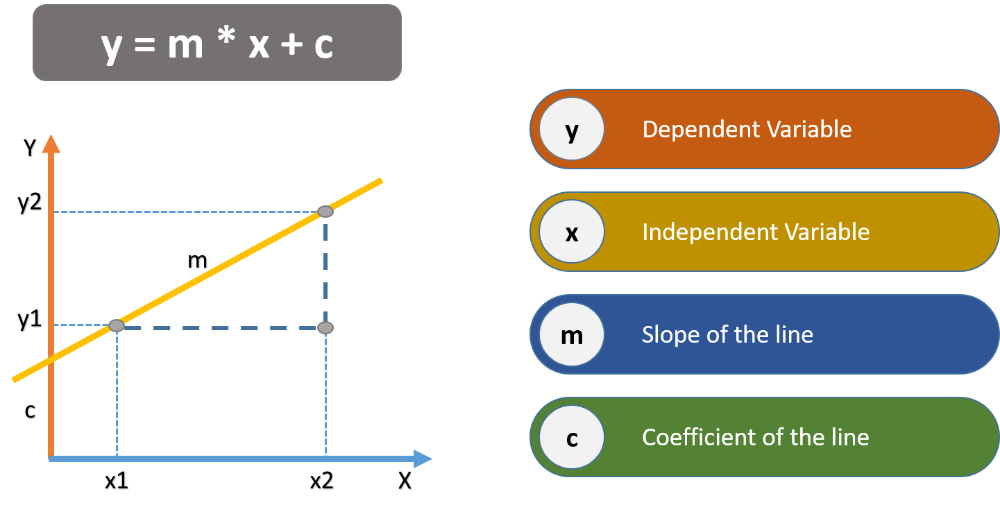
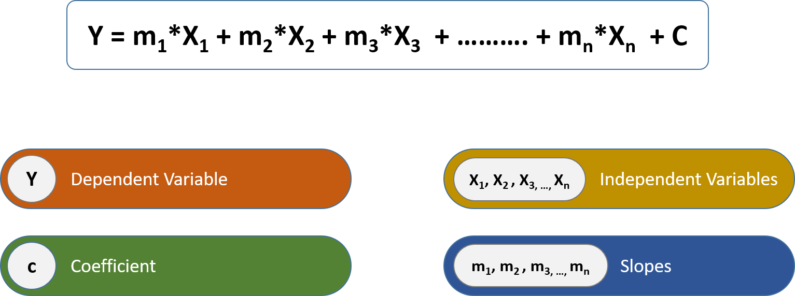

# Linear Regression With Sales Prediction Project

**Video Link Of Complete Project https://youtu.be/ZPPiZvvpU6s**

Linear Regression is a machine learning algorithm based on supervised learning. It performs a regression task. Regression models a target prediction value based on independent variables. It is mostly used for finding out the relationship between variables and forecasting.

 It performs the task to predict a dependent variable value (y) based on a given independent variable (x). So, this regression technique finds out a linear relationship between x (input) and y(output). 

The simplest form of a simple linear regression equation with one dependent and one independent variable is represented by:

**Similarly for multiple variable** 

## Project

Let’s consider a problem statement, a company wants to increase its sells to a certain amount. Now the challenge is to find the amount of investment on advertisement that will result the gain in sells.

To solve this problem we have to get the history of the investment and the sales value and prepair our dataset.

Next we have to create a Logistic Regression model and fit the dataset with the model. After testing if we get that model is working fine then we will save the model for future use.
Finally we have to integrate the model with a GUI, in this project we will create a tkinter GUI.

Code Link: 
Linear_regression: simple_and_multiple_linear_regression.ipynb 
GUI Integration : integrating_model_with_gui.ipynb

Hope you have enjoyed learning this, if so share this with others and for more such contents you can connect with me on 

YouTube: https://www.youtube.com/channel/UCmF8qppe02J1ot4Jfwl_lFg

LinkedIn: https://www.linkedin.com/in/jagwithyou/

Medium: https://medium.com/@jagwithyou
